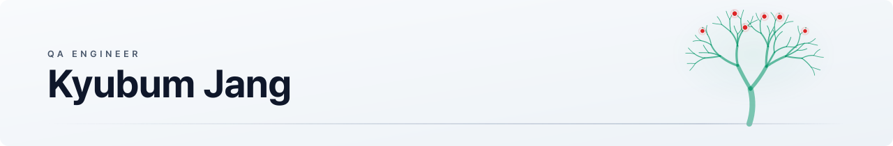

<picture>
  <source media="(prefers-color-scheme: dark)" srcset="assets/banner-dark.svg"/>
  
</picture>

 

---

## About

스타트업에서 React와 TypeScript로 화면을 만들며 커리어를 시작했고, 지금은 커머스·B2B 서비스의 품질관리를 맡고 있습니다.

직접 코드를 짜 봤던 게 가장 도움이 되는 순간은 "여기가 먼저 깨지겠다"가 보일 때입니다. 그래서 테스트도 기능 목록 순서가 아니라 위험한 순서로 봅니다. 사람이 매번 똑같이 반복해야 하는 확인은 스크립트와 AI 쪽으로 넘기고, 판단이 필요한 자리에 사람을 남겨두는 게 제가 생각하는 좋은 QC입니다.

혼자 잘하는 것보다 팀이 같은 기준으로 판단할 수 있게 만드는 일에 더 관심이 많습니다. 그래서 프로세스 가이드와 온보딩 문서를 꾸준히 쓰고 있습니다.

> 나무처럼 꾸준히 가지를 뻗어, 결국 열매를 맺는 사람이 되고 싶습니다.

<b>English</b>

 

I'm Kyubum (Lawrence) Jang, a QA engineer who started out as a frontend developer. I began my career building products with React and TypeScript at a startup, and I now handle quality control for commerce and B2B services.

Having shipped production code myself, I tend to spot where things will break before I open the test plan — so I test in order of risk, not in order of the feature list. Repetitive checks go to scripts and AI; people stay where judgment is actually needed.

I care more about getting a team to judge quality by the same standard than about being the best tester in the room, which is why I keep writing process guides and onboarding docs.

## What I Do

| 영역 | 내용 |
| :-- | :-- |
| **Release QC** | 애드콘 · 애드콘비즈 · 비즈애드콘 · 애드웰 정기 배포 검수. 운영 환경 핵심 시나리오 점검과 HTML QC 리포트 발행까지 |
| **External QA** | 외부 고객사 WEB/MOBILE QA. 테스트 계획서 · 결함 관리 · 품질 통계 대시보드 산출물 표준 세트 구축 |
| **AI × QC** | AI TC 생성기 품질 분석 및 개선 설계. 중복 제거, 커버리지 갭 분석, 우선순위 기반 도입 로드맵 |
| **Automation** | 서비스 자동점검 개발, Playwright 회귀 자동화, 검증 스크립트 |
| **Process** | 7단계 QC 프로세스 가이드, RBT(Risk-Based Testing) 분류 체계, 신규 입사자 온보딩 문서 |

## Toolbox

| 분류 | 스택과 쓰임 |
| :-- | :-- |
| **테스트 자동화** | Playwright, Python — 회귀 스위트와 서비스 자동점검 스크립트 |
| **AI** | Claude — TC 생성·정제, 중복/커버리지 갭 분석, 품질 게이트 설계 |
| **협업 · 관리** | Redmine, Notion, Slack, Excel |
| **프론트엔드** | TypeScript, JavaScript, React, Next.js, React Query, Recoil, Emotion, vanilla-extract |
